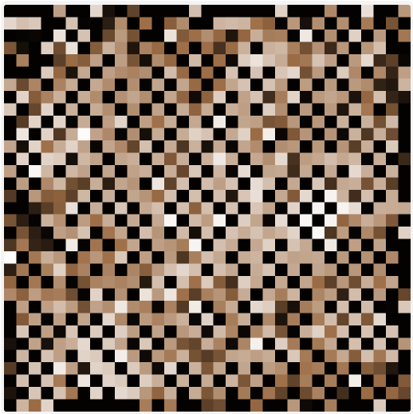

# Rainfall-Induced Terrain Erosion Simulation Using a Static Agent-Based Model

Este repositorio contiene la implementación técnica y el artículo académico del proyecto desarrollado para la asignatura **Computación Inteligente** del  
**Máster en Sistemas Inteligentes y Aplicaciones Numéricas en Ingeniería (SIANI)**  
**Universidad de Las Palmas de Gran Canaria**.

El proyecto aborda el estudio de **procesos de erosión del terreno inducidos por precipitación** mediante un modelo de **agentes estáticos (parches)**, centrándose en la interacción entre lluvia, pendiente, transporte de sedimentos y condiciones de contorno, así como en la **estabilización geomorfológica** del sistema.

---

## 🖼️ Capturas de la Simulación

El modelo permite visualizar en tiempo real:
- La evolución topográfica del terreno.
- La acumulación y transporte de agua.
- El movimiento de sedimentos entre celdas vecinas.
- La formación de estructuras estables bajo distintos regímenes hidrológicos.
- La disipación de agua y sedimento en los bordes del dominio.

Ejemplos de ejecuciones:

#### Ejemplos antes y después de iniciar ejecución

**Antes:**

**Después:**

---

#### Experimento 1 — Ejecuciones representativas

**Ejecución 1**

**Ejecución 5**

**Ejecución 10**

---

#### Experimento 2 — Ejecuciones representativas

**Ejecución 1**

**Ejecución 5**

**Ejecución 10**

---

#### Experimento 3 — Ejecuciones representativas

**Ejecución 1**

**Ejecución 5**

**Ejecución 10**

---

## 📝 Resumen del Proyecto

Se presenta un modelo de agentes estáticos sobre una cuadrícula bidimensional, donde cada parche representa una celda del terreno caracterizada por su altura, cantidad de agua acumulada, sedimento disponible y un coeficiente de erosionabilidad.

El sistema implementa reglas locales de precipitación, erosión dependiente de la pendiente, transporte de sedimentos, deposición, evaporación y condiciones de contorno absorbentes. A partir de estas interacciones locales emergen **dinámicas globales de erosión y estabilización**, permitiendo analizar cómo distintos regímenes hidrológicos afectan a la morfología final del terreno.

---

## 🧪 Diseño Experimental

Cada escenario experimental se ejecuta **10 veces** con distintas semillas aleatorias para capturar la variabilidad estocástica del sistema.

Para cada ejecución se registran métricas globales tras alcanzar un **estado estacionario**, definido mediante un criterio estadístico basado en la estabilidad de la altura media y su varianza durante una ventana temporal deslizante.

---

### Experiment 1 — Moderate Rainfall Regime

**Objective:**  
Analizar la evolución del terreno bajo un régimen de precipitación y erosión moderados.

**Main parameters:**
- `rain-rate = 0.3`
- `erosion-rate = 0.05`
- `deposition-rate = 0.1`
- `evaporation-rate = 0.05`

**Expected behavior:**  
Estabilización progresiva del terreno con pérdida moderada de material y heterogeneidad topográfica contenida.

---

### Experiment 2 — High Rainfall and Erosion

**Objective:**  
Evaluar el impacto de un aumento de la precipitación y de la intensidad erosiva sobre el tiempo de estabilización y la variabilidad del terreno.

**Main parameters:**
- `rain-rate = 0.6`
- `erosion-rate = 0.08`
- `deposition-rate = 0.05`
- `evaporation-rate = 0.05`

**Expected behavior:**  
Estabilización más temprana, mayor pérdida neta de altura y aumento de la varianza topográfica.

---

### Experiment 3 — Deposition-Dominated Regime

**Objective:**  
Estudiar la conservación de masa y la morfología final del terreno bajo regímenes dominados por deposición.

**Main parameters:**
- `rain-rate = 0.1`
- `erosion-rate = 0.03`
- `deposition-rate = 0.15`
- `evaporation-rate = 0.05`

**Expected behavior:**  
Alturas medias finales más elevadas y menor pérdida global de material, con estabilización más lenta.

---

## 📊 Métricas Analizadas

Las métricas principales analizadas son:

- **Time to stabilization** ($t_s$)
- **Mean terrain height** at stabilization
- **Height variance** at stabilization
- **Mean accumulated water**
- **Temporal evolution of terrain morphology**

Los resultados cuantitativos completos se presentan en el artículo académico incluido en este repositorio.

---

## 🛠️ Instrucciones de Ejecución

El modelo puede ejecutarse **tanto en NetLogo de escritorio como en NetLogo Web**, sin necesidad de instalación local.

---

### Opción A — NetLogo de Escritorio

1. Instala **NetLogo 6.x** o superior.
2. Descarga o clona este repositorio.
3. Abre el archivo principal del modelo (`.nlogox`) en NetLogo.
4. En la interfaz:
   - Ajusta los parámetros o selecciona uno de los escenarios experimentales.
   - Pulsa **Setup** para inicializar el entorno.
   - Pulsa **Go** para iniciar la simulación.
5. Observa las gráficas y monitores para analizar la dinámica poblacional en tiempo real.

---

### Opción B — NetLogo Web (sin instalación)

1. Accede a `https://www.netlogoweb.org/` y selecciona **NetLogo Web**.
2. Descarga o clona este repositorio.
3. En la página de NetLogo Web:
   - Haz clic en el botón junto a la opción **“Upload a model”**.
   - Selecciona el archivo `.nlogox` incluido en este repositorio.
4. Una vez cargado el modelo, en la interfaz:
   - Ajusta los parámetros o selecciona uno de los escenarios experimentales.
   - Pulsa **Setup** para inicializar el entorno.
   - Pulsa **Go** para iniciar la simulación.
5. Observa las gráficas y monitores para analizar la dinámica poblacional en tiempo real.

---
